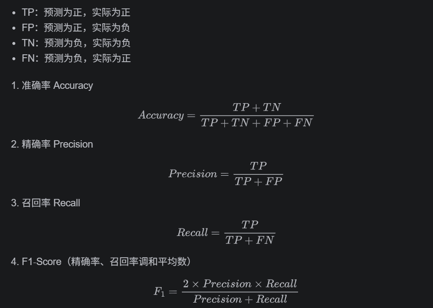

## 一.简介

---

- 使用HuggingFace提供的 bert-base-chinese模型
- 使用sklearn计算精确率 (Precision)、召回率 (Recall)、准确率 (Accuracy)、F1‑Score 作为模型评估指标
- 使用swanlab实现训练过程可视化
- 使用json文件管理超参数及文件路径
- 以准确率为参考保存最优模型
- 设置随机种子，保证训练复现
- 添加早停 

## 二.环境配置

---

- python 3.10.20
- pytorch 2.5.1
- cuda 12.1

## 三.项目结构

---

```
Demo1
├── config
│   └── config.json           # 配置文件
├── data                      # 数据集文件
├── models
│   ├── best_bert             # 模型存储
│   └── tokenizer             # 分词器存储
├── src
│   ├── swanlog               # swanlab文件
│   ├── configloader.py       # 用于加载config.json中的配置
│   ├── dataset.py            # Dataset子类，数据集加载
│   ├── model.py              # 使用BertModel和线性层搭建分类模型
│   ├── predict.py            # 输入标题，打印预测结果
│   ├── test.py               # 测试
│   ├── train.py              # 训练加评估
│   └── utils.py              # 工具类
└── .gitignore
```
## 四.数据集

---
每行为一条数据，以`_!_`分割的个字段，从前往后分别是 新闻ID，分类code（见下文），分类名称（见下文），新闻字符串（仅含标题），新闻关键词

使用分类code作为类别映射为0到14，共15个label，使用新闻标题作为text。
```markdown
6552431613437805063_!_102_!_news_entertainment_!_谢娜为李浩菲澄清网络谣言，之后她的两个行为给自己加分_!_佟丽娅,网络谣言,快乐大本营,李浩菲,谢娜,观众们
```
``` python
 # 分类id与名称映射关系
 id2name = {
    100: "民生",
    101: "文化",
    102: "娱乐",
    103: "体育",
    104: "财经",
    106: "房产",
    107: "汽车",
    108: "教育",
    109: "科技",
    110: "军事",
    112: "旅游",
    113: "国际",
    114: "证券",
    115: "农业",
    116: "电竞"
}
```

## 五.运行

---
-  `dataset` `train` `evaluate` `predict`中都有独立主函数可测试功能
- `train`用于模型测试和评估，在Demo1路径下使用终端配合输入的超参数运行，例如`python src/train.py --lr 0.00001`
-  也可以改变使用json文件` python  src/train.py --config_path ./config/config.json`
- `predict` 用于加载保存的模型，可随意输入新闻标题预测分类结果

## 六.结果分析

---
- swanlab: 📁 View project at https://swanlab.cn/@ZhangShenLong/Demo_1
### 超参数设置：
- 批次大小 batch‑size：32
- 训练轮数 epochs：10
- 学习率 lr分别使用0.00001，0.00002，0.00003
- 最大长度
- FFN dropout 0.1（使用默认）
- 多头注意力 dropout 0.1（使用默认）

> 理论上说，较大lr更新更快，但临近最优时会产生震荡。较小lr收敛较慢，需要更多训练。

>dropout 过大可抑制过拟合，但会造成震荡和收敛速度慢，泛化能力下降。过小收敛快，但容易过拟合。

## 其他

---
### 1. 参数计算公式



### 2. Huggingface BertModel结构

总体流程 LayerNorm -> 注意力 -> 残差 -> LayerNorm -> FFN -> 残差

#### ①.BertEmbeddings
  
对应Bert输入时的Token Embedding，Position Embedding， Segment Embedding,最后相加

- word_embeddings(词表大小, 隐藏层大小)
- position_embeddings(最大句长, 隐藏层大小)
- token_type_embeddings(句子类型大小, 隐藏层大小)
- 三者相加
- LayerNorm 层归一化 均值为0，方差为1，在乘以权重参数 加上偏移(权重和偏移可学习)
- Dropout

#### ②.BertEncoder

由BerLayer组成，BertLayer构成如下：

- BertAttention
  - ├── BertSelfAttention
  - └── BertSelfOutput
- BertIntermediate
- BertOutput


>- BertSelfAttention
>  - 实现 softmax(Q(K^T)/√dk)V 其中dk为 隐藏层数/头数

>- BertSelfOutput包括 
>  - Linear(隐藏层大小, 隐藏层大小)
>  - 残差后送入 LayerNorm
>  - Dropout

>- BertIntermediate包括
>  - Linear(隐藏层大小, intermediate大小)
>  - 激活函数(默认Gelu)
>- BertOutput包括
>  - Linear(intermediate大小, 隐藏层大小)
>  - 残差后送入 LayerNorm
>  - Dropout
>- 以上两个组成FFN 

#### ③.BertPooler(可选)

- Linear(隐藏层大小, 隐藏层大小)，只传入[CLS]
- 非线性激活Tanh

#### ④.forward输出

-  last_hidden_state[batch_size, sequence_length, hidden_size] 经过所有BertLayer的输出
-  pooler_output[batch_size, hidden_size] [CLS]经过Pooler的输出
- past_key_values 注意力计算使用的 key-value s